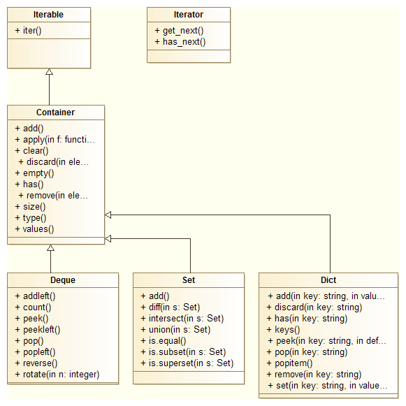

```{r knitr-setup, include = FALSE}
knitr::opts_chunk$set(
  collapse = TRUE,
  comment = "#>"
)
```

## Introduction

This package aims at providing common container data structures with typical member functions to insert, delete and access container elements. Specifically, it comes with the types [deque](https://en.wikipedia.org/wiki/Double-ended_queue), [set](https://en.wikipedia.org/wiki/Set_(abstract_data_type)), and `dict`, an [associative container](https://en.wikipedia.org/wiki/Associative_containers) resembling Python's [dict](https://docs.python.org/3/tutorial/datastructures.html#dictionaries) type. In addition, a specialized data structure called `dict.frame` is provided, which is a `dict` containing elements with identical length. The `dict.frame` can be considered a generalized and more powerful version of the base `data.frame`.

The backbone of this package are classes implemented using the [R6](https://CRAN.R-project.org/package=R6) framework. The focus for developing this package was to provide a concise data structure and specifically making use of inheritance and the reference semantics provided by the [R6](https://CRAN.R-project.org/package=R6) package. The basic class hierarchy is outlined in the class diagram below.

</br>
```{r out.width = '80%', echo = FALSE, fig.cap="Basic class hierarchy of the container package."}

```

</br>

## R6 classes and member methods

The [Container](Container.html) class as the central element serves as the base class for [Deque](Deque.html), [Set](Set.html), and [Dict](Dict.html), which inherit all methods from [Container](Container.html), with some of them being overwritten (see below). In addition, the [Container](Container.html) class inherits from the abstract *Iterable* class and therefore provides a method to create an [Iterator](Iterator.html), which can be used to iterate through the elements of any container object.

The following table shows member methods divided by class. The top half contains all [Container](Container.html) methods, each derived by a subclass to the right unless there is a new entry in a subclass column, meaning that the method is redefined in the subclass. The bottom half contains methods unique to each subclass. Note that `Dict.frame` (right-most column) inherits all methods from both [Container](Container.html) and [Dict](Dict.html).

```{=html}
<style type="text/css">
  table{
  font-size: 9pt;
  font-family: Courier New;
  font-style:monospace
}
</style>
```
| Container                  | Deque         | Set                  | Dict                         |
| :--------------------------| :-------------| :--------------------| :----------------------------|
| Container\$new()           | Deque\$new()  | s <- Set\$new()      | Dict\$new()                  |
|                            |               |                      |                              |
| add(elem)                  |               |                      | add(key, value)              |
| clear()                    |               |                      |                              |
| count(elem)                |               |                      |                              |
| delete(elem)               |               |                      | delete(key)                  |
| discard(elem)              |               |                      | discard(key)                 |
| empty()                    |               |                      |                              |
| has(elem)                  |               |                      | has(key)                     |
| peekitem()                 |               |                      |                              |
| popitem()                  |               |                      |                              |
| replace(old, new, add = F) |               |                      | replace(key, value, add = F) |
| values()                   |               |                      |                              |
|                            |               |                      |                              |
|                            | addleft(elem) | diff(s)              | get(key)                     |
|                            | peek()        | intersect(s)         | peek(key, default = NULL)    |
|                            | peekleft()    | is_equal(s)          | pop(key)                     |
|                            | pop()         | is_subset(s)         | rename(old, new)             |
|                            | popleft()     | is_proper_subset(s)  | update(other)                |
|                            | rev()         | union(s)             |                              |
|                            | rotate(n)     |                      |                              |


Table: Overview of classes and member methods

</br>

For more details visit the respective online helps (see `?Container`, `?Deque`, `?Set`, `?Dict`. Usage examples are found in the corresponding [Container](Container.html), [Deque](Deque.html), [Set](Set.html), and [Dict](Dict.html) vignettes.


## S3 classes and methods

On top of the above classes and methods, a complete [S3](http://adv-r.had.co.nz/S3.html) interface is available, which might be more familiar to most typical R users. More importantly, it allows to provide operators, for example, to access elements in the dict.frame via `[[`. In the table below, standard `set` operators are already listed for the `set` class.

| container                    | deque               | set              | dict                           |
| :----------------------------| :-------------------| :----------------| :------------------------------|
|  co = container()            |  d = deque()        |  s = setnew()    |  d = dict()                    |
|                              |                     |                  |                                |
|  add(co, elem)               |                     |                  |  add(d, key, val)              |
|  clear(co)                   |                     |                  |                                |
|  delete(co, elem, right=F)   |                     |                  |  delete(d, key)                |
|  discard(co, elem, right=F)  |                     |                  |  discard(d, key)               |
|  empty(co)                   |                     |                  |                                |
|  has(co, elem)               |                     |                  |  has(d, key)                   |
|  values(co)                  |                     |                  |                                |
|                              |                     |                  |                                |
|                              |  addleft(d, elem)   |  s1 - s2         |  getval(d, key)                |
|                              |  count(d, elem)     |  s1 / s2         |  keys(d)                       |
|                              |  peek(d)            |  s1 == s2        |  peek(d, key, default=NULL)    |
|                              |  peekleft(d)        |  s1 < s2         |  pop(d, key)                   |
|                              |  pop(d)             |  s1 > s2         |  popitem(d)                    |
|                              |  popleft(d)         |  s1 + s2         |  rename(d, old, new)           |
|                              |  reverse(d)         |                  |  setval(d, key, val, add=FALSE)|
|                              |  rotate(d, n=1L)    |                  |  sortkey(decr=FALSE)           |

Table: Overview of S3 classes and methods

</br>
For more details and to see the provided operators for each class again refer to the corresponding [Container](Container.html), [Deque](Deque.html), [Set](Set.html), [Dict](Dict.html), and [Dict.frame](Dict.frame) vignettes.
