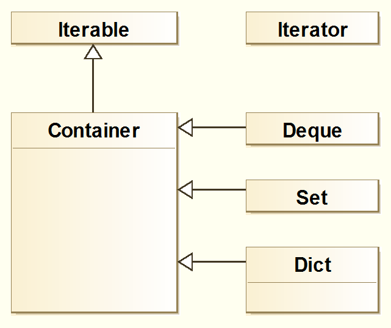

```{r knitr-setup, include = FALSE}
knitr::opts_chunk$set(
  collapse = TRUE,
  comment = "#>"
)
```

## Container examples
### Initialize, add elements
```{r lib-setup}
library(container)
```

In principle, the base `Container` is ready to be used by itself. 
```{r}
collection <-  Container$new()
collection$empty()
```

By default, the elements can be of any type:
```{r}
collection$add(1)
collection$add("A")
collection$add(data.frame(B=1, C=2))
collection$type()
```

Values can be always retrieved as standard R `list` (or `vector`, see further below)
```{r}
collection$values()
```

If initialized with an R object, it will adapt the type of the object:
```{r}
ints <- Container$new(integer())
ints$type()
```

The `add` method supports chaining:
```{r}
ints$add(1)$add(2)$add(3.7)$values()
```

Initialization also works with vectors:
```{r}
ints <- Container$new(1:10)
ints$type()
```
```{r}
ints$values()
```
```{r}
ints$size()
```

### Discard and remove
```{r}
ints$has(11)
```
```{r}
ints$has(7)
```
```{r}
ints$discard(7)
```
```{r}
ints$has(7)
```
```{r}
ints$remove(8)$has(8)
```

Using `remove` on non-existent elements throws an error
```{r}
tryCatch(ints$remove(8), error = function(e) e$message)
```

but discard does not
```{r}
ints$discard(8) # ok
```


Discard and remove work also from the right:
```{r}
ints$add(1:3)$values()
```

```{r}
ints$discard(1)$values()
```
```{r}
ints$discard(2, right=TRUE)$values()
```

### Apply and clear
```{r}
unlist(ints$apply(f = function(x) x^2))
```

```{r}
ints$clear()$empty()
```

### Reference semantics
Being based on R6 classes, any `Container` object provides reference semantics:
```{r}
members <- Container$new(c("Lisa", "Bob", "Joe"))
members$values()
```

```{r}
remove_Joe <- function(cont) cont$discard("Joe")
remove_Joe(members)
members$values()
```

### Iterator functionality
```{r}
it <- members$iter()
while(it$has_next()) print(it$get_next())
```

Once iterated to the last element, trying to iterate further will yield an error:
```{r}
tryCatch(it$get_next(), error = function(e) e$message)
```

## Methods overview
The `Container` class serves as the base class for `Deque`, `Set` and `Dict`, which inherit all methods from `Container`.
```{r out.width = '40%', echo = FALSE, fig.cap="Class diagram with basic class hierarchy."}

```


The following table shows member methods divided by class. The top half contains all `Container` methods, each derived by the subclasses to the right unless there is a new entry in a sub-class column, in which case the method is overwritten by the subclass.
The bottom half contains methods unique to each subclass.

| Container                | Deque           | Set              | Dict                      |
|--------------------------|-----------------|------------------|---------------------------|
| `iter()`                 |                 |                  |                           |
| `add(elem)`              |                 |                  | `add(key, value)`         |
| `apply(f)`               |                 |                  |                           |
| `clear()`                |                 |                  |                           |
| `discard(elem, right=F)` |                 |                  | `discard(key)`            |
| `empty()`                |                 |                  |                           |
| `has(elem)`              |                 |                  |  `has(key)`               |
| `remove(elem, right=F)`  |                 |                  |  `remove(key)`            |
| `size()`                 |                 |                  |                           |
| `type()`                 |                 |                  |                           |
| `values()`               |                 |                  |                           |
|                          |-----------------|------------------|---------------------------|
|                          | `addleft(elem)` | `union(s)`       | `keys()`                  |
|                          | `count(elem)`   | `intersect(s)`   | `peek(key, default=NULL)` |
|                          | `peek()`        | `diff(s)`        | `pop(key)`                |
|                          | `peekleft()`    | `is.equal(s)`    | `popitem()`               |
|                          | `pop()`         | `is.subset(s)`   | `set(key, value)`         |
|                          | `popleft()`     | `is.superset(s)` |                           |
|                          | `reverse()`     |                  |                           |
|                          | `rotate(n=1L)`  |                  |                           |


